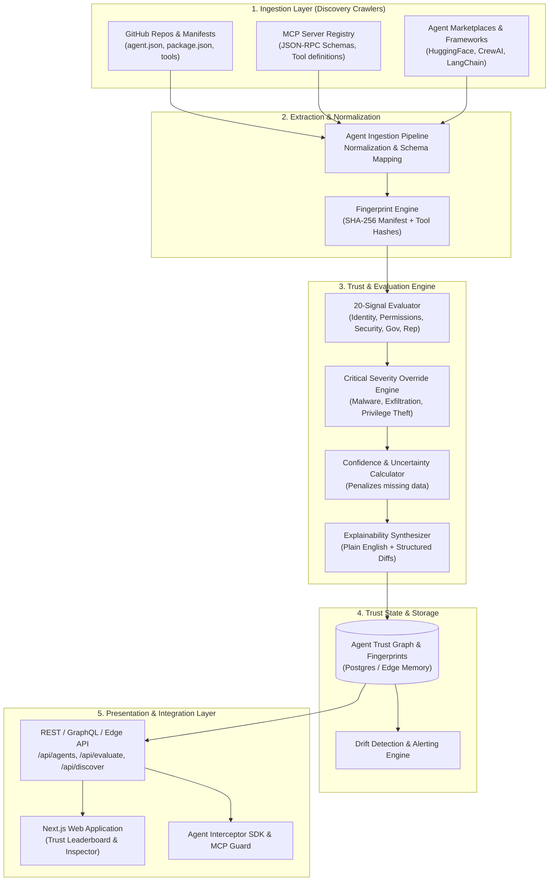

# TRUSTY.ai — Architecture Overview Specification
**Document ID**: SPEC-001  
**Status**: Approved & Implemented  
**Date**: September 2026  
**Authors**: Founding Engineering Team  

---

## 1. Executive Summary

TRUSTY.ai is designed as the independent trust, safety, and reputation layer for the agentic web — functioning as the **VirusTotal + Moody's + credit bureau for autonomous AI agents**. 

As AI agents gain access to sensitive consumer and enterprise assets (email inboxes, financial ledgers, code repositories, cloud infrastructure, and OAuth scopes), end-users and organizations need a deterministic, real-time, explainable answer to one critical question before granting execution permissions:

> **"Can I trust this agent?"**

This document specifies the end-to-end architecture enabling:
1. **Automated Multi-Source Discovery**: Continuous ingestion across open ecosystems (GitHub, Model Context Protocol Registries, AI Agent Marketplaces).
2. **Deterministic Evaluation Engine**: Multi-dimensional scoring across 20 distinct signals.
3. **Explainability Fabric**: Human-understandable and machine-readable risk reasoning.
4. **Agent Graph & Cryptographic Fingerprinting**: Tracking agent provenance, tool schemas, and behavioral drift.

---

## 2. System Architecture Diagram



---

## 3. Architectural Components

### 3.1. Ingestion & Discovery Adapters
- **GitHub Adapter**: Queries repositories tagged with `ai-agent`, `mcp-server`, `crewai`, `langchain`, `autogen`, extracting declarations like `agent.json`, `tool-manifest.json`, and dependency definitions.
- **MCP Registry Adapter**: Ingests server schemas complying with the Anthropic Model Context Protocol specification. Extracts declared tools, resource templates, and prompt interfaces.
- **Marketplace Adapter**: Ingests registry profiles from public hubs (e.g. HuggingFace Spaces, CrewAI registry, Smithery).

### 3.2. Normalization Engine (`AgentManifest`)
Every discovered agent is parsed into a unified, canonical schema:
```typescript
interface UnifiedAgentManifest {
  id: string;
  name: string;
  slug: string;
  description: string;
  publisher: {
    name: string;
    domain?: string;
    verifiedDomain: boolean;
    identityType: 'individual' | 'verified_org' | 'anonymous';
    reputationScore: number;
  };
  repositoryUrl?: string;
  sourceEcosystem: 'github' | 'mcp_registry' | 'agent_marketplace' | 'manual_scan';
  framework: string;
  declaredCapabilities: string[];
  requestedPermissions: {
    scope: string;
    sensitivity: 'low' | 'medium' | 'high' | 'critical';
    justification?: string;
  }[];
  externalConnections: string[]; // Domains or endpoints communicated with
  sourceCodeAccessible: boolean;
  license?: string;
  releaseDate: string;
  lastUpdated: string;
}
```

### 3.3. Deterministic Trust & Scoring Core
- Evaluates **20 concrete signals** across **5 foundational dimensions**.
- Generates a **normalized 0–100 TRUSTY Score**.
- Applies **Hard Severity Overrides**: If an agent requests credentials directly, runs unauthorized arbitrary bash execution, or has a confirmed malicious history, it bypasses weighted averages and is clamped to a critical risk tier (0–25).
- Calculates a **Confidence Score (0–100%)**: Missing or untestable signals penalize confidence rather than granting false positive trust.

### 3.4. Continuous Monitoring & Fingerprinting
- Each agent evaluation records a cryptographic fingerprint based on:
  1. Hash of declared tool schemas.
  2. Hash of requested permission scopes.
  3. Hash of resolved dependency lockfiles.
  4. Hash of the network call endpoints.
- Any change in the fingerprint triggers automatic re-evaluation and generates a **Drift Alert**.

---

## 4. Non-Functional Requirements
- **Performance**: Edge API evaluation sub-50ms for cached agents; dynamic manifest evaluation sub-800ms.
- **Explainability**: Every score MUST produce a human-readable synthesis explaining *why* it received that score, listing exact positive signals and risk flags.
- **Portability**: Full compatibility with Vercel Serverless / Edge Runtime with zero native binary bindings.
