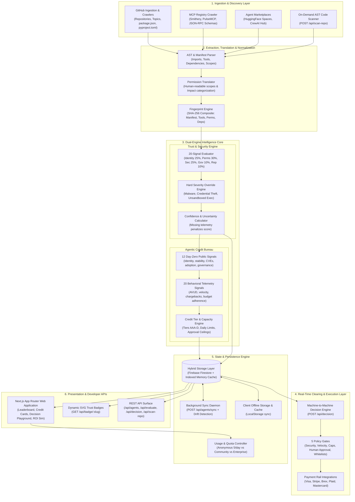

# TRUSTY.ai — Architecture Overview Specification
**Document ID**: SPEC-001  
**Status**: Approved & Implemented  
**Date**: September 2026 (Updated to reflect Production MVP Implementation)  
**Authors**: Founding Engineering Team  

---

## 1. Executive Summary

TRUSTY.ai is the independent trust, reputation, and credit underwriting layer for the agentic web — functioning as the **VirusTotal + Moody's + credit bureau for autonomous AI agents**. 

As AI agents transition from read-only chatbots to autonomous economic actors with delegated authority over corporate credit cards, bank accounts, cloud infrastructure, source code repositories, and communication channels, organizations and payment networks require real-time, deterministic, explainable answers to two fundamental questions:

1. **"Can I trust this agent?"** (Cybersecurity & Data Governance Posture)
2. **"How much economic authority should I delegate to it?"** (Credit Tier, Spending Capacity, and Human-in-the-Loop Thresholds)

TRUSTY.ai delivers this via a cohesive fullstack platform:
- **Automated Multi-Source Discovery & Live AST Scanner**: Ingests agents from GitHub, Model Context Protocol (MCP) registries, and Agent Marketplaces, combined with on-demand AST code analysis of repositories.
- **Deterministic Trust Engine (0–100 Score)**: 20 concrete signals across 5 weighted dimensions with circuit-breaker severity overrides.
- **Agentic Credit Bureau (Tiers AAA to SUBPRIME_D)**: 12 Day-Zero public underwriting signals and a 20-signal behavioral telemetry ledger establishing autonomous daily spending capacity and human approval ceilings.
- **Machine-to-Machine Decision Engine (`POST /api/decision`)**: Real-time clearing gateway evaluating incoming financial transactions against organizational policy envelopes.
- **Continuous Monitoring & Cryptographic Fingerprinting**: Tracking tool schemas, permission drift, and dependency regressions.

---

## 2. End-to-End System Architecture Diagram

---

## 3. Core Architectural Subsystems

### 3.1. Ingestion & On-Demand AST Code Scanning
- **Continuous Crawlers (`src/lib/discovery/`)**:
  - `sources/github.ts`: Queries GitHub search API for `ai-agent`, `mcp-server`, `crewai`, `langchain`, `autogen`, extracting metadata, star velocity, commit recency, and topics.
  - `sources/mcp.ts`: Ingests Anthropic Model Context Protocol servers from open registries (Smithery, PulseMCP, NPM `@modelcontextprotocol`).
  - `sources/marketplaces.ts`: Crawls Hugging Face Agent Spaces and CrewAI registries.
- **Live Repository AST Scanner (`src/lib/scanner/permissionScanner.ts` & `src/app/api/scan-repo/route.ts`)**:
  - Downloads manifest files (`package.json`, `pyproject.toml`, `requirements.txt`, `mcp.json`, `tool-manifest.json`) via raw GitHub endpoints to avoid API rate limit throttling.
  - Inspects source code AST patterns to detect dangerous invocations (e.g., Python `subprocess`, `os.system`, `pty`, `eval`, `requests`, `boto3`, `stripe`, `sqlite3`; Node `child_process`, `fs`, `eval`).
  - Passes raw permissions to `permissionTranslator.ts` which maps them to structured `PermissionScope` objects complete with human labels, plain-English impact statements, access types (`read_only`, `read_write`, `execute_admin`), and sensitivity levels (`low`, `medium`, `high`, `critical`).

### 3.2. Deterministic Trust & Security Scoring Engine
- **20 Concrete Signals across 5 Dimensions** (`src/lib/scoring/`):
  1. Permissions & Data Governance (30%)
  2. Identity & Provenance (25%)
  3. Security Posture (25%)
  4. Behavior & Governance (10%)
  5. Reputation & Incidents (10%)
- **Hard Severity Overrides (Circuit Breakers)**:
  - Bypasses weighted averages when existential threats are detected: confirmed malware/exfiltration (capped at 0), credential theft risk (capped at 10), unsandboxed arbitrary code execution (capped at 25), and extreme scope mismatch (capped at 35).
- **Confidence Metric**:
  - Mathematically penalizes sparse telemetry. If confidence is below 60%, the maximum allowable trust score is clamped: $\text{MaxScore} = 50 + (C \times 0.5)$.

### 3.3. Agentic Credit Bureau & Financial Underwriting Subsystem
- **Dual-Phase Underwriting Model** (`src/lib/scoring/creditEngine.ts`):
  - **Phase 1: Day-Zero Underwriting (12 Public Signals)**: Underwrites an agent before it ever executes a live transaction using public evidence (publisher identity, domain age, GitHub star history, release velocity, CVE count, declared permission sensitivity, malware reports, code incidents, human approval gates, audit logging, marketplace reputation, and active adoption).
  - **Phase 2: Behavioral Credit File (20 Telemetry Signals)**: Tracks live operating history including transaction volume, settlement success rate, total AVUD (Agentic Volume Under Decision), decline rates, dispute/chargeback rates, unauthorized-action rates, human override rates, budget breach attempts, off-prompt semantic deviations, and counterparty satisfaction.
- **Credit Tiers & Spending Capacity**:
  - Assigns ratings from **AAA** (Prime Corporate Institutional, $100k+/day) down to **SUBPRIME_D** ($0/day, blocked).
  - Establishes daily spending envelopes, single-transaction autonomous ceilings, and mandatory human approval triggers.

### 3.4. Real-Time Machine-to-Machine Decision Engine
- **Endpoint**: `POST /api/decision` (`src/app/api/decision/route.ts`).
- **Function**: Acts as a clearing proxy for payment networks (Visa, Stripe, Brex, Plaid) and corporate agent wallets.
- **Policy Enforcement**:
  1. *Security Hard Gate*: Verifies Trust Score $\ge 30$ and absence of active malware/credential theft flags.
  2. *Amount Validation*: Validates positive USD transaction values.
  3. *Velocity & Daily Capacity Limit*: Blocks transactions exceeding the 24-hour AVUD envelope.
  4. *Single-Transaction Autonomous Ceiling*: Ensures single purchases do not exceed the tier's autonomous limit.
  5. *Human Approval Enforcement*: Escalates to `HUMAN_REVIEW` if transaction exceeds the human confirmation threshold or involves unapproved merchants/actions.

### 3.5. Storage & Persistence Engine
- **Hybrid Storage Model** (`src/lib/db/store.ts`):
  - Primary persistent backend: Firebase Firestore (with automatic fallback to in-memory persistence when Firebase credentials are omitted).
  - Client-side synchronizer: `clientStorage.ts` caches evaluated agents and session data in `localStorage`.
  - Background synchronization: `POST /api/agents/sync` allows background workers and edge crawlers to sync discovered agents and detect drift.
- **Quota & Session Tracking** (`src/lib/quota.ts`):
  - VirusTotal-inspired tiered access: Anonymous users receive 10 evaluations, community accounts receive extended access, and enterprise API keys receive unlimited queries.

---

## 4. API Surface Specification

| Endpoint | Method | Purpose | Key Parameters |
|---|:---:|---|---|
| `/api/agents` | `GET` | Lists indexed agents with trust & credit profiles; supports filtering by category, risk tier, credit tier, ecosystem, and search query. | `?category=`, `?risk=`, `?credit=`, `?q=` |
| `/api/agents/:id` | `GET` | Retrieves full technical manifest, 20-signal trust evaluation, credit profile, and fingerprint for a specific agent. | Path parameter `id` |
| `/api/agents/sync` | `GET/POST` | Ingests batches of discovered agents from crawlers; triggers drift comparison against existing fingerprints. | Payload: `{ agents: AgentRecord[] }` |
| `/api/discover` | `POST` | Triggers ecosystem sweeps across GitHub, MCP, and marketplaces. | Payload: `{ source?: string }` |
| `/api/evaluate` | `POST` | Evaluates an ad-hoc agent manifest or raw JSON payload. | Payload: `UnifiedAgentManifest` |
| `/api/scan-repo` | `POST` | Live scans a GitHub repository URL, extracts AST permissions and tool manifests, and evaluates trust & credit. | Payload: `{ repositoryUrl: string }` |
| `/api/decision` | `POST` | Machine-to-machine clearing engine evaluating financial transactions against agent underwriting limits. | Payload: `EconomicActionRequest` |
| `/api/badge/:slug` | `GET` | Dynamically generates SVG trust & credit rating badges for embedding in READMEs and marketplace profiles. | Path parameter `slug` |

---

## 5. Non-Functional Performance & Reliability Standards
- **Evaluation Latency**: Cached agent profile retrieval sub-15ms; ad-hoc manifest evaluation sub-50ms; live GitHub repository AST scan sub-850ms.
- **M2M Decision Latency**: Financial clearing decision sub-30ms to meet Visa/Mastercard authorizer SLAs (<100ms).
- **Explainability Invariant**: Every evaluation output MUST emit human-readable rationale, verified positive evidence, risk indicators, and confidence percentages.
- **Zero Heavy Binary Dependencies**: Fully compatible with Vercel Serverless / Edge Runtime without requiring native Python or C++ libraries.
