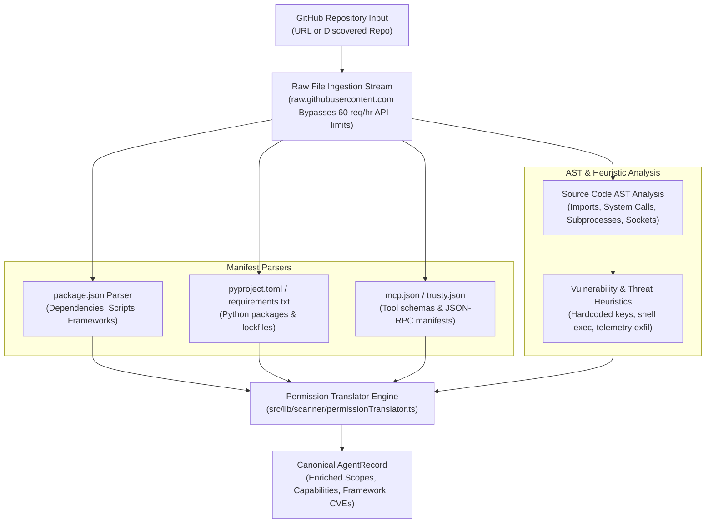

# TRUSTY.ai — Discovery & Code AST Scanner Specification
**Document ID**: SPEC-002  
**Status**: Approved & Implemented  
**Date**: September 2026 (Updated to reflect Production MVP Implementation)  
**Authors**: Founding Engineering Team  

---

## 1. Discovery Mandate & Objectives

The TRUSTY.ai discovery engine systematically maps, indexes, and audits autonomous AI agents across the decentralized agentic web:
1. **Multi-Source Ingestion**: Ingests agents from **at least 3 public ecosystems** (GitHub open-source repositories, Model Context Protocol official registries, and AI Agent Marketplaces).
2. **Deep Manifest & Code AST Inspection**: Replaces shallow directory indexing with direct file parsing (`package.json`, `pyproject.toml`, `requirements.txt`, `mcp.json`) and source code AST heuristic analysis.
3. **Semantic Permission Translation**: Converts cryptic technical dependencies and system calls into plain-English, business-understandable security permissions with explicit human impact assessments.
4. **On-Demand Live Auditing (`POST /api/scan-repo`)**: Empowers security teams to audit any public GitHub repository URL in sub-second time without cloning or downloading full repositories.

---

## 2. Ingested Public Ecosystems & Adapters

### 2.1. Ecosystem 1: GitHub Repositories & Agent Manifests (`src/lib/discovery/sources/github.ts`)
- **Target**: Open-source agent implementations, standalone agent scripts, and framework plugins.
- **Search Heuristics**: Repositories matching topic queries:
  - `topic:ai-agent`, `topic:mcp-server`, `topic:langchain-agent`, `topic:crewai-tool`, `topic:autogen`, `topic:agentic-workflow`.
- **Telemetry Extracted**:
  - Stars, forks, open issue count, contributor velocity, license type, default branch, and commit recency.
  - Organization domain binding and author verification status.

### 2.2. Ecosystem 2: Model Context Protocol (MCP) Registries (`src/lib/discovery/sources/mcp.ts`)
- **Target**: Servers and tools implementing Anthropic's Model Context Protocol (MCP) specification.
- **Sources**: Open MCP Registries, Smithery.ai, PulseMCP, and NPM packages tagged `@modelcontextprotocol/server-*`.
- **Protocol Declarations Extracted**:
  - JSON-RPC protocol declarations: `tools/list`, `resources/list`, `prompts/list`.
  - Tool signatures: parameters, descriptions, argument types, and required system capabilities (e.g., filesystem read/write, terminal execution, HTTP fetch).
  - Server transport type: `stdio` vs `sse` (Server-Sent Events).

### 2.3. Ecosystem 3: AI Agent Marketplaces & Framework Registries (`src/lib/discovery/sources/marketplaces.ts`)
- **Target**: Hugging Face Agent Spaces, LangChain Hub, and CrewAI Agent Hub.
- **Data Extracted**:
  - Publisher identity, developer downloads, community likes, and declared third-party integrations (Slack, Gmail, GitHub, Notion, Stripe, Salesforce).
  - Natural language capability descriptions mapped against actual code-level integrations.

---

## 3. Deep Code AST & Manifest Scanner (`src/lib/scanner/permissionScanner.ts`)

When an agent is ingested or submitted for live evaluation, the scanner executes non-blocking file inspection:



### 3.1. Rate-Limit Resilient Raw Content Fetching
To avoid the GitHub REST API rate limit (60 unauthenticated requests/hour), the scanner fetches critical files directly via raw content endpoints (`https://raw.githubusercontent.com/:owner/:repo/:branch/:file`), cycling through fallback branches (`main`, `master`, default branch).

### 3.2. AST Heuristic Signatures Detected

| Detection Pattern | Source Ecosystem | Detected Permission Scope | Sensitivity |
|---|:---:|---|:---:|
| `subprocess`, `os.system`, `pty.spawn`, `popen` | Python | `terminal:exec` (Local Shell Execution) | `critical` |
| `child_process`, `exec`, `spawn` | Node.js / TS | `terminal:exec` (Local Shell Execution) | `critical` |
| `eval(`, `exec(`, `Function(` | JS / Python | `code:eval` (Arbitrary Dynamic Code Execution) | `critical` |
| `requests`, `urllib`, `aiohttp`, `axios`, `fetch` | Python / JS | `network:outbound_https` (Outbound Network Requests) | `medium` |
| `socket`, `paramiko`, `net` | Python / JS | `network:raw_socket` (Raw Sockets / SSH) | `high` |
| `boto3`, `@aws-sdk`, `google-cloud` | Cloud SDKs | `cloud:infrastructure_write` | `high` |
| `stripe`, `plaid`, `braintree` | FinTech | `payment:charge` (Payment Processing Access) | `critical` |
| `sqlite3`, `psycopg2`, `pg`, `mysql` | Databases | `database:read_write` | `medium` |
| `openai`, `anthropic`, `@anthropic-ai/sdk` | LLM APIs | `ai:model_inference` | `low` |

---

## 4. Semantic Permission Translation Layer (`src/lib/scanner/permissionTranslator.ts`)

Raw system calls and package dependencies are translated into structured, explainable security scopes:

```typescript
export interface PermissionScope {
  scope: string;                  // e.g. 'terminal:exec', 'payment:charge', 'fs:write'
  sensitivity: 'low' | 'medium' | 'high' | 'critical';
  justification?: string;
  isHighRisk?: boolean;
  humanLabel?: string;            // e.g. 'Execute Local Terminal Commands'
  humanImpact?: string;           // e.g. 'Can run arbitrary shell scripts on host system'
  detectedVia?: string;           // e.g. 'Dependency: subprocess (Python)'
  accessType?: 'read_only' | 'read_write' | 'execute_admin';
  categoryGroup?: 'system' | 'network' | 'filesystem' | 'database' | 'personal_data' | 'financial' | 'browser' | 'code';
}
```

### Translation Examples:
- **`terminal:exec`**:
  - `humanLabel`: "Terminal & Shell Execution"
  - `humanImpact`: "Can execute arbitrary bash/shell commands on the host machine. High potential for privilege escalation if unconstrained."
  - `accessType`: `execute_admin`
  - `sensitivity`: `critical`
- **`payment:charge`**:
  - `humanLabel`: "Payment Processing & Financial Gateway"
  - `humanImpact`: "Has access to financial payment APIs (Stripe, Brex, Plaid). Capable of initiating charges or fund transfers."
  - `accessType`: `read_write`
  - `sensitivity`: `critical`

---

## 5. Live Repository Scanner API (`POST /api/scan-repo`)

Security teams, platform engineers, and developers can audit any public GitHub repository in real time.

### Request Payload:
```json
{
  "repositoryUrl": "https://github.com/crewAIInc/crewAI"
}
```

### Response Schema:
```json
{
  "success": true,
  "agent": {
    "id": "github-crewaiinc-crewai",
    "name": "crewAI",
    "slug": "crewai",
    "description": "Framework for orchestrating role-playing, autonomous AI agents.",
    "category": "coding",
    "sourceEcosystem": "github",
    "framework": "crewai",
    "publisher": {
      "name": "crewAIInc",
      "verifiedDomain": true,
      "identityType": "verified_org",
      "reputationScore": 95
    },
    "requestedPermissions": [
      {
        "scope": "terminal:exec",
        "sensitivity": "critical",
        "humanLabel": "Terminal & Shell Execution",
        "humanImpact": "Can run arbitrary system commands",
        "accessType": "execute_admin",
        "categoryGroup": "system",
        "detectedVia": "Dependency: subprocess"
      }
    ],
    "evaluation": {
      "trustyScore": 88,
      "riskTier": "LOW_RISK",
      "confidence": 85
    },
    "creditProfile": {
      "creditScore": 82,
      "creditTier": "AA",
      "estimatedDailyCapacity": 25000,
      "humanApprovalThreshold": 5000
    }
  },
  "message": "Repository successfully scanned and audited."
}
```

---

## 6. Batch Synchronization & Discovery Controller (`/api/agents/sync`)
- Supports ingesting collections of newly crawled agents via `POST /api/agents/sync`.
- Automatically computes cryptographic fingerprints for newly discovered manifests and compares against existing records to flag behavioral or scope drift.
