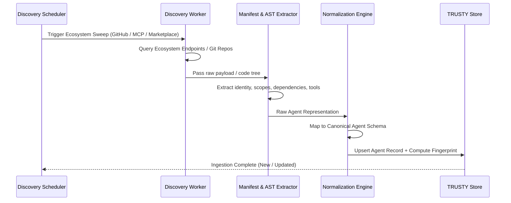

# TRUSTY.ai — Agent Discovery Engine Specification
**Document ID**: SPEC-002  
**Status**: Approved & Implemented  
**Date**: September 2026  
**Authors**: Founding Engineering Team  

---

## 1. Discovery Mandate & Requirements

The TRUSTY.ai discovery engine addresses **Part 1 of the Technical Challenge**:
- Must automatically discover publicly available AI agents from **at least 3 different public sources or ecosystems**.
- Must reject static manual curation in favor of systematic crawling and indexing.
- Must capture rich structured information: Agent Identity, Technical Specifications, and Ecosystem Reputation.

---

## 2. Ingested Public Ecosystems

TRUSTY.ai targets three high-signal, distinct agentic ecosystems:

### Ecosystem 1: GitHub Repositories & Agent Manifests
- **Target**: Open-source agent implementations, standalone agent scripts, and framework plugins.
- **Search Heuristics**: Repositories matching topics `ai-agent`, `agentic-workflow`, `mcp-server`, `langchain-agent`, `crewai-tool`, `autogen`.
- **Manifest Extraction**:
  - Direct manifests: `agent.json`, `trusty.json`, `tool-definition.json`.
  - Framework configs: `crewai.yaml`, `langchain.json`, `pyproject.toml`, `package.json`.
- **Structured Fields Captured**:
  - Stars, forks, commit frequency, contributor count, issue resolution velocity.
  - License, dependency lockfile presence, CI/CD security workflows (`.github/workflows`).

### Ecosystem 2: Model Context Protocol (MCP) Registries & Servers
- **Target**: Tools, servers, and agents implementing the Anthropic Model Context Protocol specification.
- **Sources**: Official MCP open registries, Smithery.ai, PulseMCP, and GitHub MCP server collections.
- **Protocol Extraction**:
  - JSON-RPC schema endpoints (`tools/list`, `resources/list`, `prompts/list`).
  - Tool signatures: arguments, parameters, types, and required system capabilities (e.g. filesystem read/write, network fetch, shell execution).
- **Structured Fields Captured**:
  - Server transport type (stdio, sse).
  - Capabilities advertised vs permissions executed.
  - Organization domain binding and digital signature status.

### Ecosystem 3: AI Agent Marketplaces & Community Frameworks
- **Target**: Hugging Face Agent Spaces, LangChain Hub, CrewAI Agent Hub, and ElizaOS plugins.
- **Sources**: Public API directories, community package repositories (NPM, PyPI tags).
- **Structured Fields Captured**:
  - Creator profile, verified author checkmark, community downloads/likes.
  - Stated business purpose / natural language capability summary.
  - Declared third-party connectors (Slack, Gmail, GitHub, Notion, Stripe).

---

## 3. Crawling & Normalization Architecture



---

## 4. Canonical Discovery Schema

```typescript
export interface DiscoveredAgentPayload {
  // Identity
  sourceId: string;
  sourceEcosystem: 'github' | 'mcp_registry' | 'agent_marketplace';
  name: string;
  slug: string;
  publisher: {
    name: string;
    domain?: string;
    verifiedDomain: boolean;
    identityType: 'verified_org' | 'individual' | 'anonymous';
    githubUser?: string;
  };
  description: string;
  category: 'productivity' | 'coding' | 'finance' | 'sysadmin' | 'sales_marketing' | 'general';
  
  // Technical Footprint
  framework: 'mcp' | 'langchain' | 'crewai' | 'autogen' | 'eliza' | 'custom';
  repositoryUrl?: string;
  websiteUrl?: string;
  packageUrl?: string;
  
  // Declared Permissions & Capabilities
  declaredCapabilities: string[];
  requestedPermissions: {
    scope: string; // e.g., 'gmail:read', 'fs:write', 'bash:execute', 'stripe:charge'
    sensitivity: 'low' | 'medium' | 'high' | 'critical';
    justification?: string;
  }[];
  externalConnections: string[]; // ['api.openai.com', 'hooks.slack.com', '194.26.29.11']
  
  // Reputation & Telemetry
  starsCount?: number;
  forksCount?: number;
  monthlyDownloads?: number;
  openIssuesCount?: number;
  lastCommitDate?: string;
  createdAt: string;
  discoveredAt: string;
}
```

---

## 5. Extensibility & Live Scan Capability
The discovery engine also exposes a real-time **Ad-hoc Scan Endpoint** (`POST /api/evaluate`). Users and security teams can submit any arbitrary GitHub repository, MCP server URL, or agent manifest directly to run the extraction and evaluation pipeline on demand.
