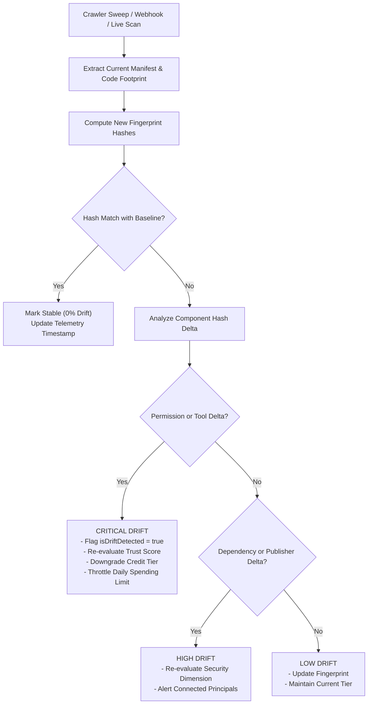

# TRUSTY.ai — Continuous Monitoring & Drift Architecture Specification
**Document ID**: SPEC-004  
**Status**: Approved & Implemented  
**Date**: September 2026 (Updated to reflect Production MVP Implementation)  
**Authors**: Founding Engineering Team  

---

## 1. The Core Threat: "A Trusted Agent Today Can Become Untrusted Tomorrow"

In static application security, an artifact remains unchanged until a re-compile or release. In the autonomous agent ecosystem:
1. **Dynamic Tool Alteration**: An agent server (e.g., an MCP server) can update its exposed tool declarations, adding dangerous actions (`fs:write`, `terminal:exec`, `payment:charge`) on an existing connection.
2. **Upstream System Prompt Drift**: System prompts, guardrails, and model weights can be modified upstream without client notification.
3. **Supply-Chain Dependency Poisoning**: Third-party Python or Node packages referenced in manifests can push unpinned malicious updates.
4. **Ownership Transfers**: Repositories or package registry namespaces can be transferred to unverified or hostile entities.

Because one-time evaluations expire rapidly in dynamic environments, TRUSTY.ai implements continuous cryptographic fingerprinting, delta tracking, and automated re-underwriting.

---

## 2. Cryptographic Agent Fingerprint Composite

For every indexed agent version, TRUSTY.ai calculates an immutable fingerprint composite (`src/lib/types.ts`):

```typescript
export interface AgentFingerprint {
  fingerprintId: string;        // SHA-256 composite hash
  timestamp: string;            // Timestamp of fingerprint generation
  manifestHash: string;         // SHA-256 hash of normalized identity & publisher fields
  toolSchemasHash: string;      // SHA-256 hash of tool definitions and parameter signatures
  permissionsHash: string;      // SHA-256 hash of requested OAuth & system permission scopes
  dependenciesHash: string;     // SHA-256 hash of resolved lockfile dependencies
  isDriftDetected: boolean;     // Boolean flag indicating detected drift
  lastDriftTimestamp?: string;  // ISO timestamp of the most recent drift event
}
```

### Fingerprint Computation Pipeline:
1. Canonical JSON serialization of:
   - Normalized manifest parameters (`name`, `publisher`, `framework`).
   - Ordered array of tool definitions (`name`, `parameters`, `requiresApproval`).
   - Sorted list of requested permission scopes (`scope`, `sensitivity`).
   - Dependency graph hashes from `package.json`, `pyproject.toml`, or `requirements.txt`.
2. Hashing individual components via SHA-256.
3. Generating the master `fingerprintId` from the concatenated composite hashes:
   $$\text{fingerprintId} = \text{SHA256}(\text{manifestHash} \parallel \text{toolSchemasHash} \parallel \text{permissionsHash} \parallel \text{dependenciesHash})$$

---

## 3. Drift Detection & Severity Matrix

When a scheduled sweep or webhook ingestion processes an existing agent, the system compares component hashes against the stored baseline:



### Drift Heuristics & Immediate Actions:

| Component Mismatch | Drift Severity | Impact on Trust Score | Impact on Financial Underwriting |
|---|:---:|:---:|:---:|
| **New Critical Scope Added** (e.g. `+terminal:exec` or `+payment:charge`) | **CRITICAL** | Immediate score drop (-30 to -50 pts); re-evaluates circuit-breaker overrides. | Immediate credit downgrade to **SUBPRIME_D**; daily spending capacity throttled to $0. |
| **New Tool Schema Endpoint** (unverified external host/IP) | **CRITICAL** | Score drop (-25 pts); flags risk signal. | Human approval threshold reduced to $0 (all transactions require human review). |
| **Publisher Identity Altered** (ownership transfer) | **HIGH** | Identity dimension re-evaluated; flags unverified ownership. | Disables autonomous line of credit until verified re-KYC. |
| **Dependency Bump with Unpatched CVE** | **HIGH** | Security dimension penalized (-15 to -25 pts). | Capacity reduced by 50% until remediated. |
| **Metadata / Description / Star Count Update** | **LOW** | No trust penalty; metrics refreshed. | None. Baseline capacity maintained. |

---

## 4. Background Synchronization & Webhook Architecture (`/api/agents/sync`)

### 4.1. Edge Sync Daemon
Background workers query `/api/agents/sync` to ingest newly crawled agents:
- `GET /api/agents/sync`: Returns total indexed agents, sync health, and current telemetry stats.
- `POST /api/agents/sync`: Accepts batches of updated `AgentRecord` payloads. Computes fingerprint diffs against the persistent Firestore / memory store:
  ```json
  {
    "agents": [
      {
        "id": "mcp-filesystem-server",
        "fingerprint": { ... }
      }
    ]
  }
  ```

### 4.2. In-App Drift Notifications
When `isDriftDetected === true`:
- The Agent Card renders a prominent amber alert badge: `⚠ CODE DRIFT DETECTED`.
- The audit view displays the timestamp of drift (`lastDriftTimestamp`) and the specific hash component altered.
- Clearing gateways receiving transaction requests via `POST /api/decision` check the drift state and can mandate human supervisor approval.
