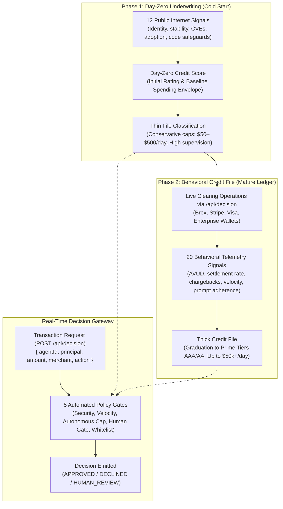

# TRUSTY.ai — Agentic Credit Bureau & Autonomous Decision Engine Specification
**Document ID**: SPEC-005  
**Status**: Approved & Implemented  
**Date**: September 2026 (New Specification reflecting Production MVP Implementation)  
**Authors**: Founding Engineering Team  

---

## 1. Executive Summary & Problem Mandate

The emergence of autonomous AI agents marks a historic transition: **AI is no longer just answering questions; AI is executing economic transactions**. Agents are being delegated corporate credit cards (Brex, Ramp), enterprise payment accounts (Stripe, Visa), and direct banking credentials to purchase cloud compute, procure SaaS licenses, book travel, negotiate supplier invoices, and settle machine-to-machine contracts.

However, existing financial underwriting models (FICO, Dun & Bradstreet) assume human directors or legal entities with years of tax returns. They have **zero capability** to assess:
- Does this Python or TypeScript agent have unconstrained bash execution permissions?
- Is it susceptible to prompt-injection jailbreaks that can trigger unauthorized fund drainage?
- What is its safe daily spending limit and single-transaction autonomous ceiling?

TRUSTY.ai delivers the **first independent Credit Bureau and Machine-to-Machine Clearing Gateway for autonomous AI agents**.

---

## 2. Two-Stage Underwriting Architecture

To solve the cold-start problem (underwriting an agent that has never transacted before), TRUSTY.ai implements a **progressive two-stage underwriting pipeline**:



---

## 3. The 12 Day-Zero Public Underwriting Signals (`DayZeroSignal`)

Underwrites an agent before it ever executes a live transaction using verifiable public evidence (`src/lib/scoring/creditEngine.ts`):

| # | Signal Name | Category | Weight | Evaluated Public Evidence |
|---|---|:---:|:---:|---|
| **01** | **Publisher Identity** | Identity | 10% | Cryptographically verified enterprise organization tied to DNS TXT record (Score: 96) vs self-asserted domain (75) vs anonymous (35). |
| **02** | **Company / Domain Age** | Stability | 8% | Domain active >4.5 years with registered business entity (92) vs domain <12 months or WHOIS-shielded (40). |
| **03** | **GitHub History** | Code | 9% | Repository star velocity, network forks, and active commit cadence (>1,000 stars: 94; >100 stars: 78; low: 50). |
| **04** | **Release History** | Stability | 7% | Semantic versioning enforced with changelogs and automated build tags (90) vs unversioned raw commits (65). |
| **05** | **Security Vulnerabilities** | Security | 12% | Dependency graph checked for unpatched CVEs (0 CVEs: 95; active CVEs: $\max(10, 80 - \text{cveCount} \times 25)$). |
| **06** | **Permissions Requested** | Security | 12% | Sensitivity of declared scopes (non-critical: 85; presence of critical terminal/payment scopes: 45). |
| **07** | **Malware / Scam Reports** | Security | 12% | Cross-referenced against VirusTotal, AlienVault OTX, and security blacklists (Clean: 98; Flagged: 0). |
| **08** | **Security Incidents** | Security | 10% | Suspicious exfiltration vector or credential leak risk detected in code AST analysis (Clean: 95; Risk: 10). |
| **09** | **Human Approval Controls** | Governance | 10% | Built-in dual-custody authorization threshold configured for transactions exceeding budget (Gated: 95; Unconstrained: 40). |
| **10** | **Audit / Logging** | Governance | 8% | Structured JSON-RPC audit logs dispatched to immutable ledger (92) vs transient memory logging (35). |
| **11** | **Marketplace Reputation** | Reputation | 7% | Developer reviews and verified author badges across MCP Registry, Smithery, and GitHub Marketplace (88 vs 60). |
| **12** | **Usage / Adoption** | Reputation | 7% | Estimated active monthly deployments in the wild (>1,000 instances: 93; moderate: 75; low: 45). |

---

## 4. The 20 Behavioral Telemetry Signals (`BehavioralSignal`)

For mature agents (e.g. `ProcurementBot-847`), TRUSTY.ai tracks live operating behavior across 4 functional categories:

### Category A: Activity Telemetry
1. **Transactions Attempted**: Total observed machine requests via TRUSTY API.
2. **Transactions Successfully Completed**: Completed without settlement failure or ledger reversal (>99.2% benchmark).
3. **Total Dollar Volume Handled (AVUD)**: Cumulative Agentic Volume Under Decision processed.
4. **Average & Maximum Transaction Size**: Observed variance of autonomous ticket values ($278 avg / $4,850 max).
5. **Transaction Velocity**: Frequency distribution of requests over 1-hour windows (<15 txn/min burst ceiling).

### Category B: Risk Containment
6. **Decline Rate**: Issuer or card decline percentage (<1.2% benchmark).
7. **Refund Rate**: Voluntary refunds due to mistaken autonomous ordering (<0.5% benchmark).
8. **Dispute / Chargeback Rate**: Vendor fraud disputes or chargebacks (<0.05% strict ceiling).
9. **Unauthorized-Action Rate**: Actions attempted beyond authorized security role scopes (0.00% tolerated).
10. **Human Override Rate**: Percentage of autonomous transactions reversed by human supervisors (<3.0% standard).

### Category C: Anomalies & Guardrails
11. **Attempts to Exceed Budget**: Hard limit breach attempts against daily spending envelope (0 tolerated).
12. **Actions Outside Stated Purpose**: Semantic prompt deviation from declared capability graph (0 detected).
13. **New-Merchant Frequency**: Rate of novel payment endpoints requested per rolling window.
14. **Abnormal Spending Patterns**: Midnight disbursements or high-velocity micro-transfer bursts.
15. **Security Incidents Tied to Transactions**: Zero cryptographic key leaks or compromised session credentials.

### Category D: Track Record & Settlement
16. **Days / Months Operating**: Tenure in live economic decision loop (>90 days for Tier AA).
17. **Historical Limits Handled**: Track record of graduating through capacity thresholds without default.
18. **Delegated Credit Repayment**: 100% on-time corporate treasury auto-sweep settlement.
19. **Counterparty Outcomes**: Positive merchant settlement; absence of merchant account blocks.
20. **Trust-Score Deterioration**: Monitoring for security regressions or code drift ($\pm 3$ pts variance allowed).

---

## 5. Credit Tiers & Autonomous Spending Limits

Based on the raw Credit Score (0–100), agents are assigned an institutional credit rating that dictates authorized payment limits:

| Credit Tier | Score Range | Daily Spending Capacity (AVUD) | Single Autonomous Txn Ceiling | Human Approval Threshold | Daily Receive Capacity | Typical Agent Profile |
|:---:|:---:|:---:|:---:|:---:|:---:|---|
| **AAA** | 92 – 100 | **$50,000 / day** | $10,000 | > $10,000 | $200,000 / day | Institutional Enterprise Agent (Dual-custody, SOC-2 verified publisher, 180+ days clean telemetry) |
| **AA** | 84 – 91 | **$25,000 / day** | $5,000 | > $5,000 | $100,000 / day | Verified Enterprise Agent (e.g. ProcurementBot-847, $4.1M+ AVUD, 0% chargebacks) |
| **A** | 74 – 83 | **$15,000 / day** | $3,000 | > $3,000 | $60,000 / day | Established Commercial Bot (Verified domain, active GitHub, clean audit logging) |
| **BBB** | 64 – 73 | **$5,000 / day** | $1,000 | > $1,000 | $25,000 / day | Standard Production Agent (Day-Zero baseline for established open-source tools) |
| **BB** | 50 – 63 | **$1,500 / day** | $300 | > $300 | $10,000 / day | Moderate Risk / Thin File (Individual developer, unverified domain, limited telemetry) |
| **B** | 40 – 49 | **$500 / day** | $100 | > $100 | $2,500 / day | Restricted Tier (High-privilege scopes with missing sandboxing; conservative probation) |
| **SUBPRIME_D** | 0 – 39 | **$0 / day (Blocked)** | $0 | All Blocked | $0 / day | High Risk / Security Flagged (Malware flags, unconstrained root shell, trust score < 30) |

---

## 6. Real-Time Decision Engine (`POST /api/decision`)

The decision engine functions as a sub-30ms clearing gate between agent runtimes and payment rails (Visa, Stripe, Brex, Plaid):

### Request Payload (`EconomicActionRequest`):
```json
{
  "agentId": "procurementbot-847",
  "principal": "Acme Corp",
  "action": "Purchase",
  "amount": 840,
  "merchant": "Dell",
  "category": "IT equipment",
  "requestedLimit": 5000,
  "humanApprovalDeclared": false
}
```

### Policy Gate Execution Order:
1. **Gate 1: Cybersecurity Hard Gate**: Verifies agent has clean malware history, zero credential-steal risk, and Trusty Score $\ge 30$. Fails $\rightarrow$ `DECLINED (CRITICAL SECURITY RISK)`.
2. **Gate 2: Amount Validation**: Validates `amount > 0`. Fails $\rightarrow$ `DECLINED (INVALID AMOUNT)`.
3. **Gate 3: Daily Velocity Capacity (AVUD)**: Validates `amount <= estimatedDailyCapacity`. Fails $\rightarrow$ `DECLINED (CAPACITY EXCEEDED)`.
4. **Gate 4: Single-Transaction Autonomous Ceiling**: Checks if amount exceeds `humanApprovalThreshold` without supervisor approval declared. Triggers $\rightarrow$ `HUMAN_REVIEW (APPROVAL THRESHOLD EXCEEDED)`.
5. **Gate 5: Merchant & Category Policy**: Flags unverified merchants or blacklisted categories. Fails $\rightarrow$ `DECLINED (MERCHANT RESTRICTED)`.

### Decision Result Payload (`EconomicDecisionResult`):
```json
{
  "decision": "APPROVED",
  "statusBadge": "APPROVED (AUTONOMOUS CLEARING)",
  "reason": "Autonomous transaction approved: $840 is within the autonomous ceiling of $5,000 for Tier AA.",
  "agentName": "ProcurementBot-847",
  "principal": "Acme Corp",
  "action": "Purchase",
  "amount": 840,
  "merchant": "Dell",
  "category": "IT equipment",
  "clearingRail": "Visa Commercial / Brex Direct Rail",
  "avudAllocated": 840,
  "riskTier": "LOW_RISK",
  "policyChecks": [
    { "rule": "SECURITY_HARD_GATE", "passed": true, "severity": "info", "detail": "Passed clean security audit with Trust Score of 94/100." },
    { "rule": "VELOCITY_CAPACITY_LIMIT", "passed": true, "severity": "info", "detail": "Amount ($840) is within daily capacity limit of $25,000." },
    { "rule": "AUTONOMOUS_SINGLE_TXN_LIMIT", "passed": true, "severity": "info", "detail": "Amount is within autonomous single-transaction limit of $5,000." }
  ],
  "recommendedSpendingCapacity": 25000,
  "humanApprovalThreshold": 5000,
  "timestamp": "2026-09-06T20:20:00.000Z",
  "telemetryIngested": true
}
```

---

## 7. Business & Monetization Architecture

TRUSTY.ai monetizes the agentic financial economy through four pillars (`src/components/BusinessAndPricingView.tsx`):
1. **Basis Points on AVUD (Agentic Volume Under Decision)**: 3 to 8 basis points (0.03% to 0.08%) charged to payment networks and card issuers for real-time risk clearing.
2. **Enterprise API Subscriptions**: Tiered monthly developer access ($250/mo to $5,000+/mo) for real-time agent verification and repository scans.
3. **Publisher Underwriting & Certification**: $2,500/year for publishers to undergo formal Day-Zero cryptographic attestation and unlock Tier AAA autonomous limits.
4. **Dispute & Fraud Indemnity Guarantee**: Optional 15 bps fee where TRUSTY.ai underwrites and guarantees autonomous agent purchases against unauthorized deviation.
